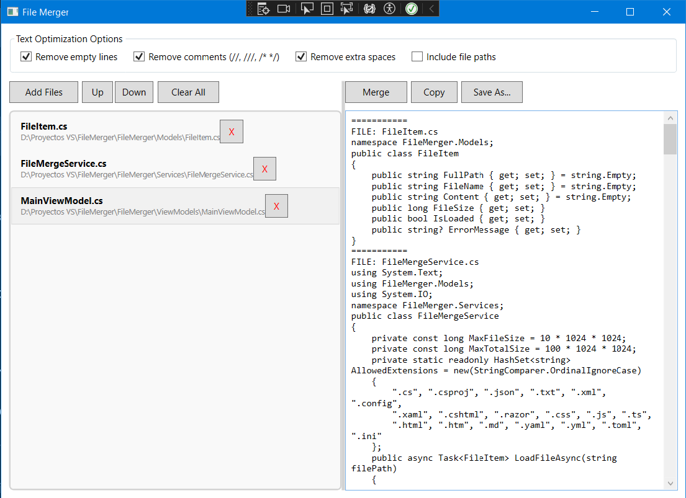

# File Merger for AI Context

A lightweight WPF desktop utility that merges multiple code and text files 
into a single structured `.txt` document.
Useful for preparing AI-friendly project context 
for tools like ChatGPT, Claude, Grok, and DeepSeek.

## Why?

Large projects are often split across many files, 
which makes sharing context with AI assistants inconvenient.
This tool helps combine selected project files into a single structured document 
that is easier to paste into LLMs.

## Features

- Add files via file dialog or drag & drop
- Preserve custom file order
- Merge files into a single structured text document
- Optional text cleanup:
  - Remove empty lines
  - Remove comments (`//`, `///`, `/* */`)
  - Normalize extra spaces while preserving indentation
- Optional exclusion of full file paths for privacy
- Copy merged output to clipboard
- Save merged output as `.txt`
- Async file loading to keep UI responsive
- File safety checks:
  - 10 MB per-file limit
  - 100 MB total merge limit
  - Binary file detection
  - Extension whitelist

## Screenshot

## Supported File Types

`.cs`, `.csproj`, `.json`, `.txt`, `.xml`, `.config`, `.xaml`, `.cshtml`, `.razor`, `.css`, `.js`, `.ts`, `.html`, `.htm`, `.md`, `.yaml`, `.yml`, `.toml`, `.ini`

## How to Use

1. **Add files:** Click "Add Files" or drag & drop files into the left panel
2. **Reorder:** Select a file and use Up/Down buttons to arrange the order
3. **Select options:** Check desired text optimizations in the top panel
4. **Merge:** Click "Merge" to combine all files
5. **Use result:** Click "Copy" for clipboard or "Save As..." to export

## Important Note About Comment Removal

The "Remove comments" option uses regex patterns to strip comments. 
**Do not use this option on XAML, XML, or HTML files** — URLs containing `//` will be damaged. 
This is a known limitation. For such files, uncheck the option before merging.

## Limitations

- Comment removal is regex-based and not language-aware
- URLs containing `//` in XAML/XML/HTML files will be damaged when using comment removal
- Very large files are intentionally blocked (10 MB per file, 100 MB total)
- Designed for text/code files only — binary files are rejected
- Not intended for binary or media files
- WPF TextBox may become slow with extremely large merged outputs (50,000+ lines)

## Tech Stack

- **.NET 9** (WPF)
- **MVVM pattern**
- Minimal dependencies:
  CommunityToolkit.Mvvm
  Microsoft .NET / WPF librariess

## Project Structure
FileMerger/
├── Models/
│ └── FileItem.cs # Data model for a single file
├── Services/
│ └── FileMergeService.cs # File reading, validation, merging logic
├── ViewModels/
│ └── MainViewModel.cs # UI logic, commands, text processing
├── MainWindow.xaml # UI layout
├── MainWindow.xaml.cs # Code-behind (drag & drop handlers)
└── App.xaml # Application entry point

## Build

Requirements:
- Visual Studio 2022
- .NET 9 SDK

dotnet build

## License

MIT